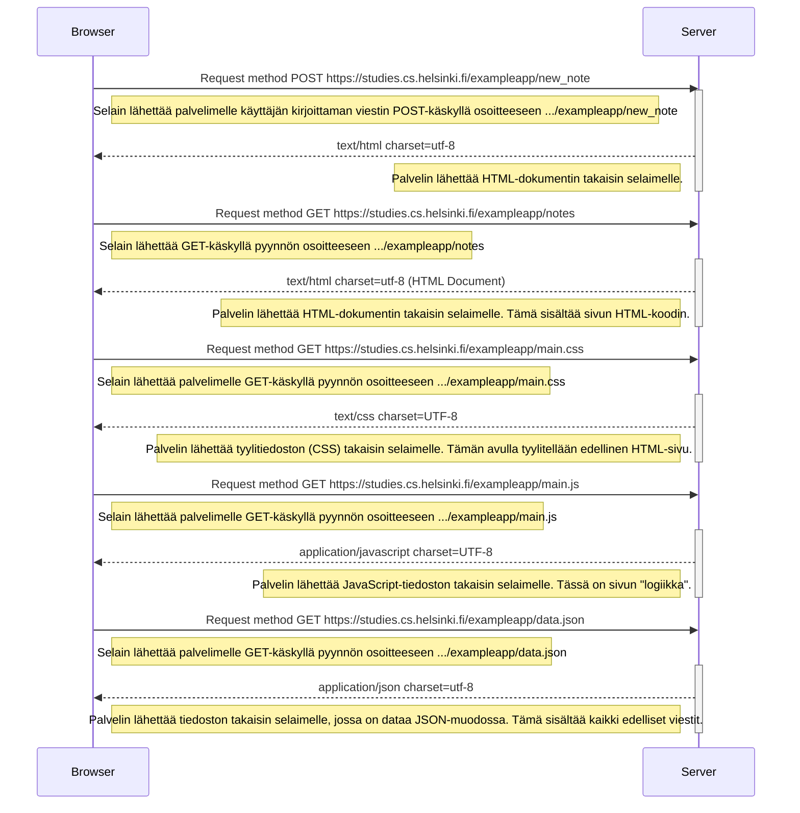

```mermaid

sequenceDiagram

participant Browser
participant Server

Browser ->> Server: Request method POST https://studies.cs.helsinki.fi/exampleapp/new_note
activate Server
Note right of Browser: Selain lähettää palvelimelle käyttäjän kirjoittaman viestin POST-käskyllä osoitteeseen .../exampleapp/new_note
Server -->> Browser: text/html charset=utf-8
Note left of Server: Palvelin lähettää HTML-dokumentin takaisin selaimelle.
deactivate Server

Browser ->> Server: Request method GET https://studies.cs.helsinki.fi/exampleapp/notes
Note right of Browser: Selain lähettää GET-käskyllä pyynnön osoitteeseen .../exampleapp/notes
activate Server
Server -->> Browser: text/html charset=utf-8 (HTML Document)
Note left of Server: Palvelin lähettää HTML-dokumentin takaisin selaimelle. Tämä sisältää sivun HTML-koodin.
deactivate Server

Browser ->> Server: Request method GET https://studies.cs.helsinki.fi/exampleapp/main.css
Note right of Browser: Selain lähettää palvelimelle GET-käskyllä pyynnön osoitteeseen .../exampleapp/main.css
activate Server
Server -->> Browser: text/css charset=UTF-8
Note left of Server: Palvelin lähettää tyylitiedoston (CSS) takaisin selaimelle. Tämän avulla tyylitellään edellinen HTML-sivu.
deactivate Server

Browser ->> Server: Request method GET https://studies.cs.helsinki.fi/exampleapp/main.js
Note right of Browser: Selain lähettää palvelimelle GET-käskyllä pyynnön osoitteeseen .../exampleapp/main.js
activate Server
Server -->> Browser: application/javascript charset=UTF-8
Note left of Server: Palvelin lähettää JavaScript-tiedoston takaisin selaimelle. Tässä on sivun "logiikka".
deactivate Server

Browser ->> Server: Request method GET https://studies.cs.helsinki.fi/exampleapp/data.json
Note right of Browser: Selain lähettää palvelimelle GET-käskyllä pyynnön osoitteeseen .../exampleapp/data.json
activate Server
Server -->> Browser: application/json charset=utf-8
Note left of Server: Palvelin lähettää tiedoston takaisin selaimelle, jossa on dataa JSON-muodossa. Tämä sisältää kaikki edelliset viestit.
deactivate Server

```

