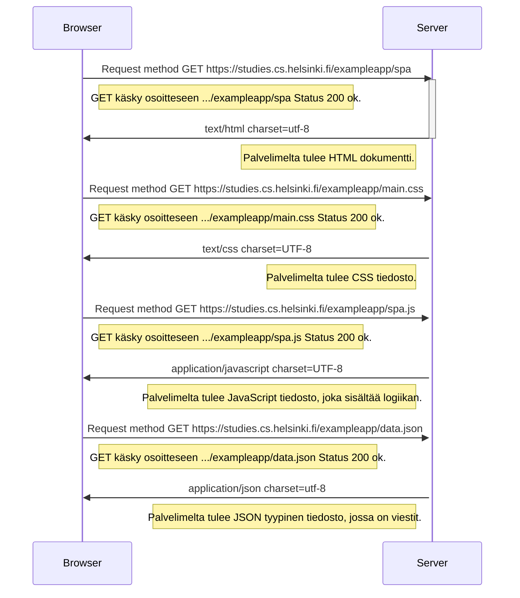

```mermaid
sequenceDiagram
participant Browser
participant Server

Browser ->> Server: Request method GET https://studies.cs.helsinki.fi/exampleapp/spa
activate Server
Note right of Browser: GET käsky osoitteseen .../exampleapp/spa Status 200 ok.
Server ->> Browser: text/html charset=utf-8
deactivate Server
Note left of Server: Palvelimelta tulee HTML dokumentti.

Browser ->> Server: Request method GET https://studies.cs.helsinki.fi/exampleapp/main.css
activate Server
Note right of Browser: GET käsky osoitteseen .../exampleapp/main.css Status 200 ok.
Server ->> Browser: text/css charset=UTF-8
Note left of Server: Palvelimelta tulee CSS tiedosto.

Browser ->> Server: Request method GET https://studies.cs.helsinki.fi/exampleapp/spa.js
activate Server
Note right of Browser: GET käsky osoitteseen .../exampleapp/spa.js Status 200 ok.
Server ->> Browser: application/javascript charset=UTF-8
Note left of Server: Palvelimelta tulee JavaScript tiedosto, joka sisältää logiikan.

Browser ->> Server: Request method GET https://studies.cs.helsinki.fi/exampleapp/data.json
activate Server
Note right of Browser: GET käsky osoitteseen .../exampleapp/data.json Status 200 ok.
Server ->> Browser: application/json charset=utf-8
Note left of Server: Palvelimelta tulee JSON tyypinen tiedosto, jossa on viestit.

```
