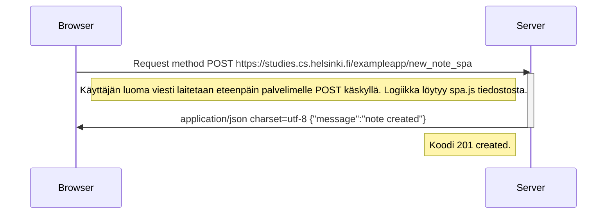

```mermaid
sequenceDiagram
participant Browser
participant Server

Browser ->> Server: Request method POST https://studies.cs.helsinki.fi/exampleapp/new_note_spa
activate Server
Note right of Browser: Käyttäjän luoma viesti laitetaan eteenpäin palvelimelle POST käskyllä. Logiikka löytyy spa.js tiedostosta.
Server ->> Browser: application/json charset=utf-8 {"message":"note created"}
deactivate Server
Note left of Server: Koodi 201 created.

```
